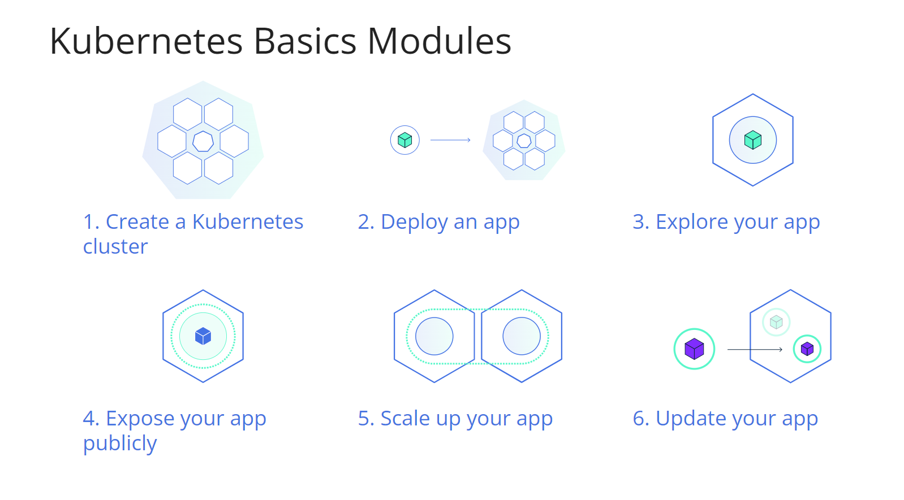
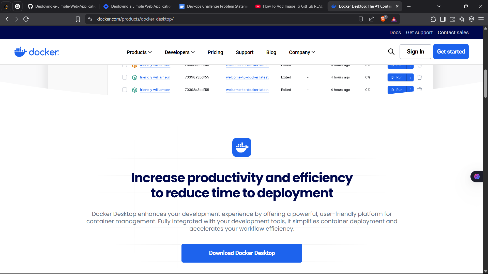
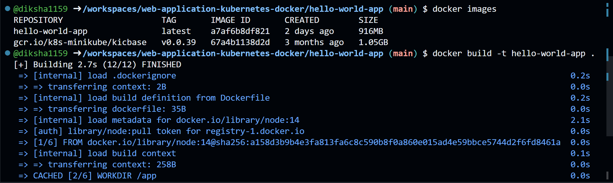
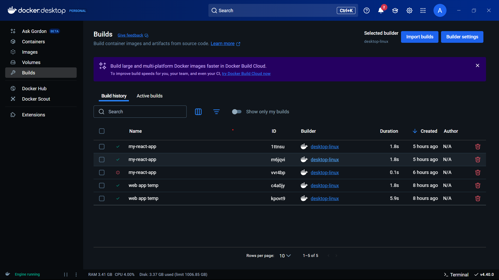
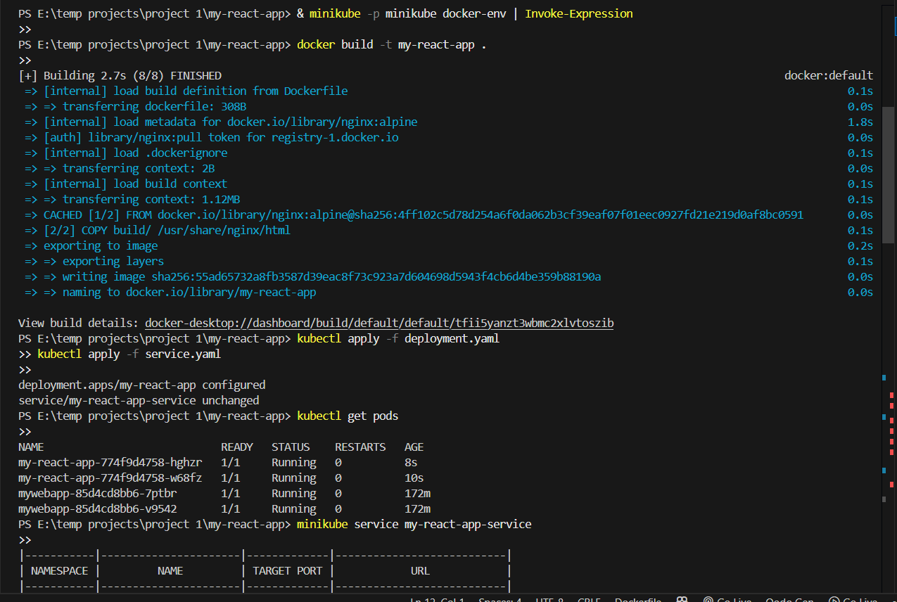
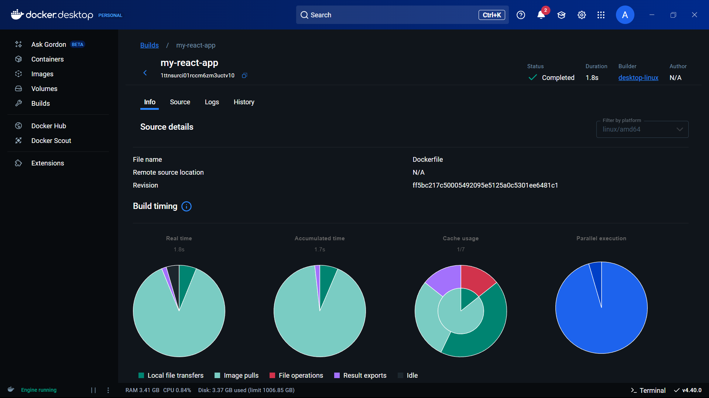

# 🚀 Deploying a React Web Application on Kubernetes using Minikube

<p align="center">  
    
</p>  

This repository demonstrates how to create, Dockerize, and deploy a React web application using Kubernetes on a local environment powered by Minikube. It’s designed for **absolute beginners** and includes installation guides, deployment commands, and troubleshooting tips.

---

## 🧱 Kubernetes Architecture

<p align="center">  
    
</p>  

## 📚 Table of Contents

- [📋 Prerequisites](#-prerequisites)
- [⚙️ Installation Guide](#️-installation-guide)
  - [1️⃣ Install Docker](#1️⃣-install-docker)
  - [2️⃣ Install Minikube](#2️⃣-install-minikube)
  - [3️⃣ Install kubectl](#3️⃣-install-kubectl)
- [🧪 Local Deployment](#-local-deployment)
  - [1️⃣ Create React App](#1️⃣-create-react-app)
  - [2️⃣ Dockerize Application](#2️⃣-dockerize-application)
  - [3️⃣ Kubernetes Setup](#3️⃣-kubernetes-setup)
  - [4️⃣ Deploy to Minikube](#4️⃣-deploy-to-minikube)
- [🌍 Global Deployment Options](#-global-deployment-options)
- [🐛 Troubleshooting](#-troubleshooting)
- [📚 References](#-references)
- [✅ Final Result](#-final-result)

---

## 📋 Prerequisites

Before proceeding, ensure your system meets the following requirements:

- ✅ 2 GB RAM or more
- ✅ 20 GB of free disk space
- ✅ Administrator/root access
- ✅ Stable internet connection

---

## ⚙️ Installation Guide

### 1️⃣ Install Docker

**Windows/macOS:**

- Download Docker Desktop from [https://www.docker.com/products/docker-desktop](https://www.docker.com/products/docker-desktop)
- Follow the installation wizard
- Enable **Kubernetes** in Docker Desktop settings

<p align="center">  
    
</p>  

```bash
docker --version
```

---

### 2️⃣ Install Minikube

Official guide: [Minikube Installation](https://minikube.sigs.k8s.io/docs/start/)

#### For Linux:
```bash
curl -LO https://storage.googleapis.com/minikube/releases/latest/minikube-linux-amd64
sudo install minikube-linux-amd64 /usr/local/bin/minikube
```

#### Start Minikube:
```bash
minikube start
```

---

### 3️⃣ Install kubectl

Official guide: [kubectl Installation](https://kubernetes.io/docs/tasks/tools/)

#### For Linux:
```bash
curl -LO "https://dl.k8s.io/release/$(curl -L -s https://dl.k8s.io/release/stable.txt)/bin/linux/amd64/kubectl"
chmod +x kubectl
sudo mv kubectl /usr/local/bin/
kubectl version --client
```

---

## 🧪 Local Deployment

### 1️⃣ Create React App
```bash
npx create-vite@latest my-react-app
cd my-react-app
npm start        # Runs on http://localhost:3000
npm run build    # Creates production build
```

---

### 2️⃣ Dockerize Application

Create a `Dockerfile` in your project root:
```Dockerfile
FROM nginx:alpine
COPY dist/ /usr/share/nginx/html
EXPOSE 80
CMD ["nginx", "-g", "daemon off;"]
```

#### Use Minikube’s Docker Daemon:
For Linux/Macos:-
```bash

eval $(minikube -p minikube docker-env)
```
For Windows:-
```Powershell

& minikube -p minikube docker-env --shell powershell | Invoke-Expression
```

#### Build Docker Image:
```bash
docker build -t my-react-app .
```

<p align="center">
  
</p>

#### Verify:
```bash
docker images
```

---

### 3️⃣ Kubernetes Setup

#### `deployment.yaml`
```yaml
apiVersion: apps/v1
kind: Deployment
metadata:
  name: my-react-app
spec:
  replicas: 2
  selector:
    matchLabels:
      app: my-react-app
  template:
    metadata:
      labels:
        app: my-react-app
    spec:
      containers:
        - name: my-react-app
          image: my-react-app
          ports:
            - containerPort: 80
          imagePullPolicy: IfNotPresent
```

#### `service.yaml`
```yaml
apiVersion: v1
kind: Service
metadata:
  name: my-react-app-service
spec:
  type: NodePort
  selector:
    app: my-react-app
  ports:
    - protocol: TCP
      port: 80
      targetPort: 80
      nodePort: 30036
```

---

### 4️⃣ Deploy to Minikube
```bash
kubectl apply -f deployment.yaml
kubectl apply -f service.yaml
kubectl get pods
```

<p align="center">
  
</p>

#### Access the App:
```bash
minikube ip
```

Then open in your browser:
```bash
http://<minikube-ip>:30036
```
alternative:-
```Powershell
minikube service my-react-app-service
kubectl port-forward svc/my-react-app-service 8080:80
```
---

## 🌍 Global Deployment Options

### Option 1: Cloud Kubernetes (GKE, EKS, AKS)

#### Push image to DockerHub:
```bash
docker tag my-react-app your-dockerhub-username/my-react-app
docker push your-dockerhub-username/my-react-app
```

Then update `deployment.yaml` to use your DockerHub image and deploy it to:

- Google Kubernetes Engine (GKE)
- Amazon EKS
- Azure AKS

---

### Option 2: Static Hosting (React is static!)
```bash
npm run build
```

Then deploy the `build/` folder to:

- [Vercel](https://vercel.com)
- [Netlify](https://netlify.com)

---

## 🐛 Troubleshooting

### Problem: `ImagePullBackOff`

**✅ Fixes:**

1. **Rebuild inside Minikube Docker:**
   ```bash
   eval $(minikube -p minikube docker-env)
   docker build -t my-react-app .
   ```

2. **Ensure image name matches in `deployment.yaml`**

3. **Delete old pods:**
   ```bash
   kubectl delete pod -l app=my-react-app
   ```

4. **Describe the pod for details:**
   ```bash
   kubectl describe pod <pod-name>
   ```

---

## 📚 References

- [Minikube Docs](https://minikube.sigs.k8s.io/)
- [Docker Docs](https://docs.docker.com/)
- [Kubernetes Docs](https://kubernetes.io/docs/home/)
- [React Docs](https://reactjs.org/)

---

## ✅ Final Result

Your React app should now be running locally on Kubernetes using Minikube and is ready to be deployed globally!

<p align="center">
  
</p>
<p align="center">
  
</p>
<p align="center">
  
</p>
